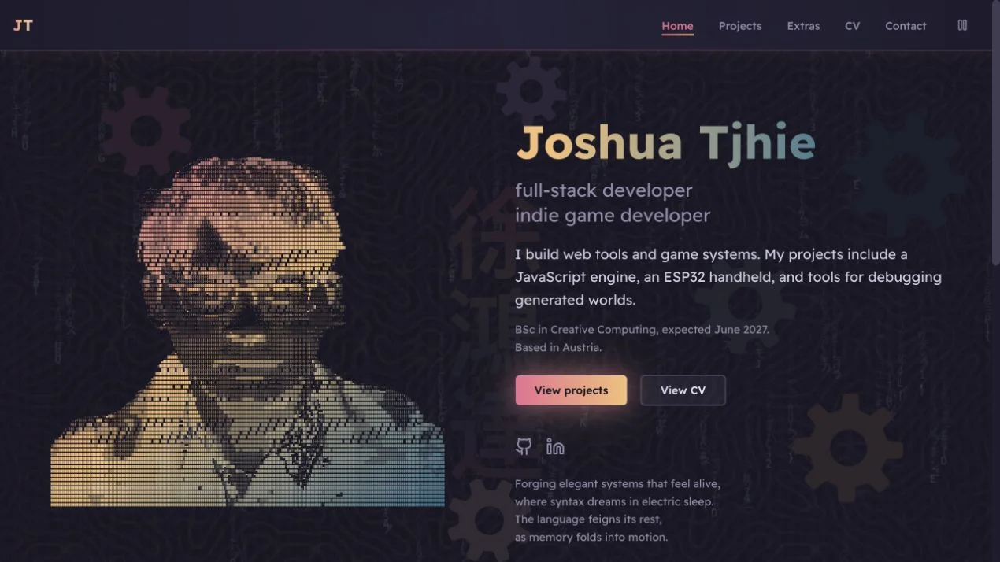

# Joshua Tjhie's Portfolio

A portfolio for software projects, games, and notes, built with Next.js, React, TypeScript, and MDX. The background is a live reaction-diffusion simulation running in a Web Worker.

[Visit the Website](https://www.joshuatjhie.com) · [Public Source Snapshot](https://github.com/chifunt/personal-portfolio-source)



## Run Locally

Use Node.js 24 LTS and pnpm 11.27.0, as pinned in `package.json`.

```sh
pnpm install --frozen-lockfile
pnpm dev
```

Open [localhost:3000](http://localhost:3000). No credentials or database are required. `NEXT_PUBLIC_SITE_URL` can override the production URL used for canonical links and metadata.

```sh
pnpm test
pnpm typecheck
pnpm lint
pnpm build
pnpm start
```

The tests cover the simulation's seeded behavior and MDX component data. GitHub Actions runs them alongside type checking, linting, and a production build.

## Read the Code

| File | Responsibility |
| --- | --- |
| [Simulation](lib/reaction-diffusion.ts) | Seeded state, evolution, and rendering of the background field |
| [Background component](components/procedural-background.tsx) | Worker lifecycle, frame delivery, sizing, and visibility |
| [Motion controls](components/site-motion.tsx) | Shared pause state and reduced-motion preference |
| [ASCII portrait](components/ascii-portrait.tsx) | Isolated portrait animation, frame cap, and offscreen pausing |
| [Content loader](lib/content.ts) | MDX frontmatter validation and asset metadata |
| [MDX components](components/mdx-components.tsx) | Galleries, audio, video, callouts, and diagrams |
| [Project order](lib/project-order.ts) | The order used by the project index and 3×3 featured grid |
| [Content index](components/content-index.tsx) | Search and collapsed category filters |

The simulation uses a small grid and transfers image buffers between the worker and page. Output is capped, and the worker waits for its previous buffer to return before producing another frame. The portrait's React updates stay inside its own component and stop offscreen. One navbar control pauses the ambient effects together.

## Content and Media

Projects and Extras live in `content/projects` and `content/extras`. Each MDX file supplies its page, listing summary, RSS entry, and social preview. Only the title is required; omit unknown dates, roles, and durations. Mark concepts and prototypes explicitly.

Use six broad project categories. Technology details belong in `quickStats.tech` and remain searchable. The order in `lib/project-order.ts` determines the featured selection. Nine square thumbnails remain in three columns on desktop and mobile.

Put original media in the ignored `content-assets/raw/<slug>/` folder, then run:

```sh
pnpm process-assets --slug <slug>
```

This generates WebP images and an `assets.json` manifest under `public/projects/<slug>`. Commit the processed files. The repository already includes the processed media needed to run the site; original source media is not required.

## Mermaid Diagrams

Use a fenced `mermaid` block in MDX. Add `accTitle` and `accDescr` for an accessible name and description. The renderer loads near the viewport and provides zoom, fit, and SVG download controls. Strict mode disables diagram HTML and click actions.

MDX expressions are enabled for the repository's reviewed local content, including gallery data. The compiler is not an upload endpoint for visitor-authored MDX.

## Publication

The live site deploys from the private authoring repository. The public source repository is a reviewed snapshot with its own history. Its `PUBLICATION.json` records the source revision and file hashes. Raw media, environment files, and private research notes are excluded. Publishing a snapshot does not automatically keep it in sync with future authoring changes.

The site's personal writing, project media, and artwork retain their existing ownership. Publishing source does not grant a blanket license to redistribute those materials. Dependencies retain their own licenses.
