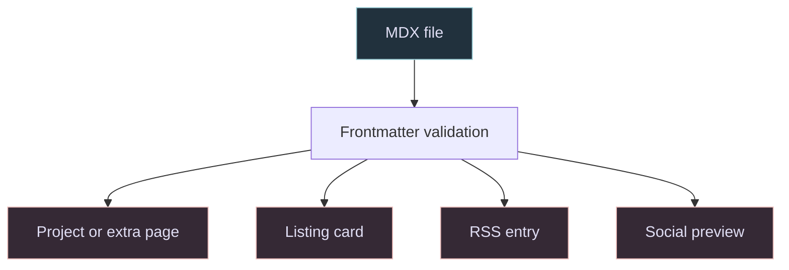

The faint patterns behind this page are being calculated in your browser. Each visit starts a fresh reaction-diffusion simulation, and the shapes continue to develop while the page is open.

I wanted my interest in procedural generation to be visible before anyone opened a project. The harder part was giving that experiment enough movement to notice while leaving room to read. Small patterns sit behind the content, in the same Rose Pine colours as the ASCII portrait and gears.

## Keeping the Pattern Evolving

Changing the starting seed gives each visit a different beginning. Continued movement needs more than a fresh start. This version gradually moves between selected feed and removal settings, adds a gentle flow, and introduces small local disturbances without resetting the whole field.

The simulation runs in a Web Worker on a small grid. A canvas scales and repeats the result across the page, so a larger browser window does not require a simulation cell for every screen pixel.

The worker sends at most 12 frames per second on desktop and eight on smaller screens. It limits each batch of simulation steps to about six milliseconds and waits for its previous image buffer to return before sending another frame. A busy page therefore cannot accumulate a queue of old frames.

The navbar's pause icon stops the pattern, gears, and matrix effect together and remembers the choice. The simulation pauses when the tab is hidden. A reduced-motion preference starts the ambient effects paused.

## Giving a Project Room to Explain Itself

The home page offers square thumbnails and titles. A writeup can then show what the thumbnail leaves out, such as a game in motion or the steps in a generator. Search and tag filters help readers find related work in the full index.

Projects and Extras live in MDX files. Their frontmatter supplies the titles, summaries, tags, and media paths used across the site. Zod validates those fields when the content loads.

The same summary appears on the listing card and in the entry's metadata. Adding a writeup creates its page and includes it in the RSS feed. Keeping those views tied to one file reduces the places where an old description can survive an edit.

The body supports galleries, video, audio, code, tables, and related entries. Mermaid diagrams use the site's palette and allow zooming or an SVG download. Their renderer loads as they approach the viewport, and local videos wait for the reader to press play.

<Image
  src="/projects/personal-portfolio/personal-portfolio-projects.webp"
  alt="The Games filter on the Projects page, with cards for Copperfall and The Circussy One."
  caption="Filtering the index to Games puts Copperfall and The Circussy One together."
  width={1280}
  height={720}
/>

Living Patch Maps takes the interest in evolving patterns into a research concept. It proposes a way to record structural changes and inspect the evidence behind labels such as "split" or "merge".

<RelatedContent slug="living-patch-maps" title="Inspecting How Patterns Change" />

## Keeping Motion Out of the Reading Path

The ASCII portrait originally rebuilt its character field through the homepage component on every animation frame. Its animation now lives in a separate component and updates at most 24 times per second. It stops when the portrait leaves the viewport. The full portrait is available before JavaScript runs, and assistive technology receives one portrait label instead of thousands of decorative characters.

Project categories are kept to six. Filters start collapsed, and searching also checks the technologies listed inside each project. Long writeups have a quieter background behind their paragraphs, while media and diagrams retain more width.

The regression suite checks seeded simulation behavior and MDX component data. Continuous integration runs those tests with type checking, linting, and a production build.
